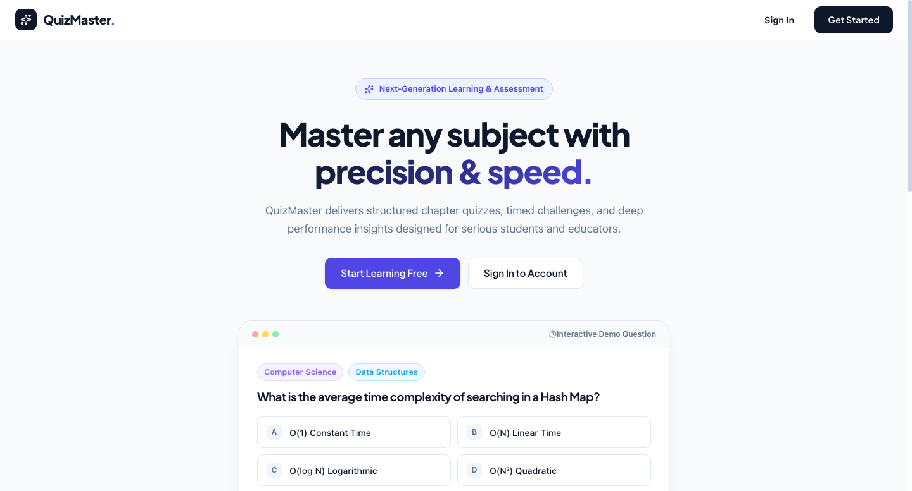
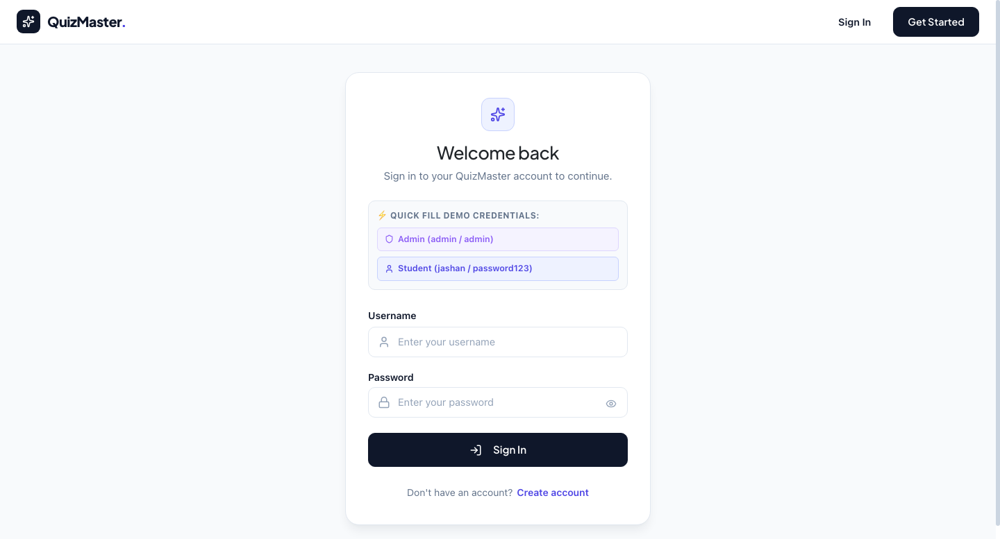
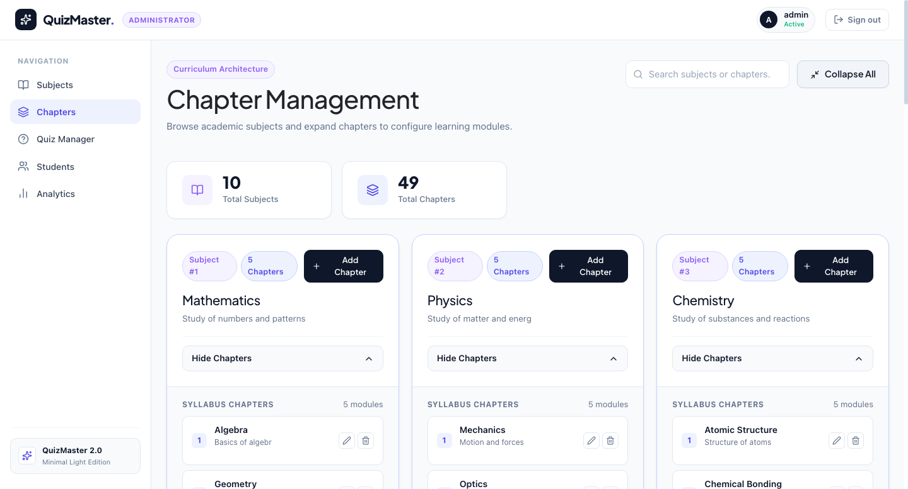
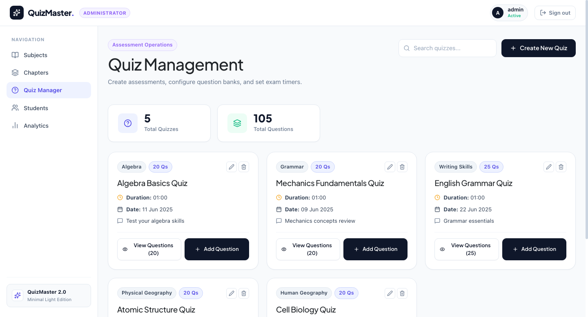
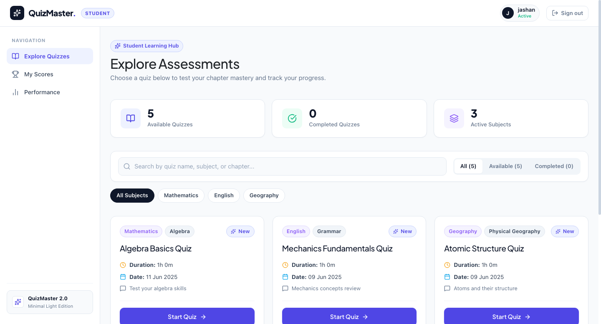
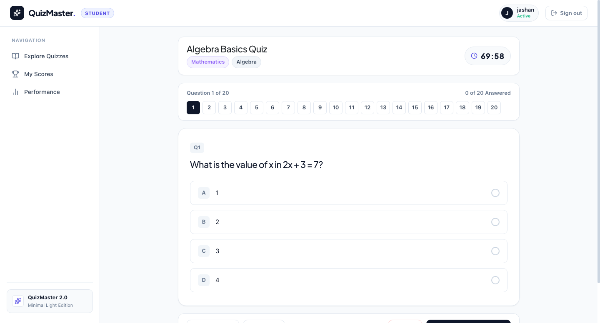
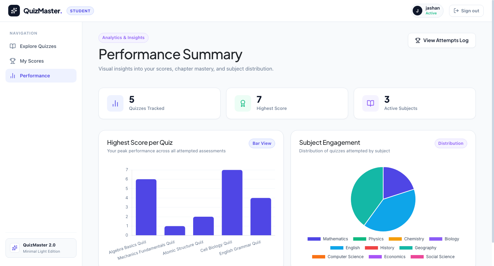
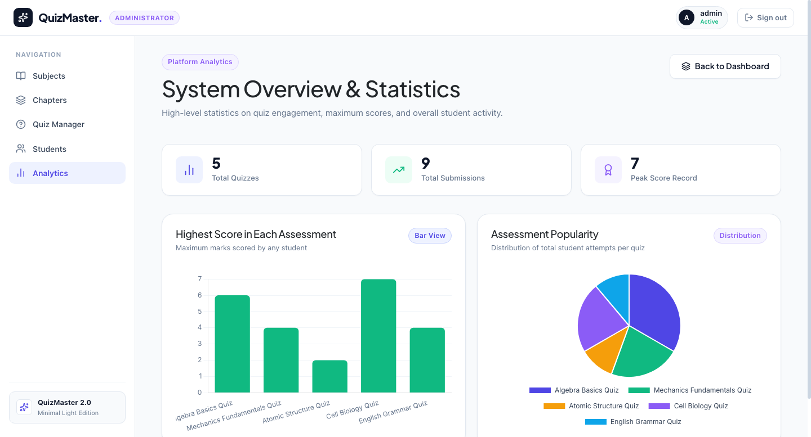

# ⚡ QuizMaster 2.0 — Enterprise Assessment Platform

<p align="center">
  
</p>

<p align="center">
  
  
  
  
  
  
  
</p>

---

## 📖 Overview

**QuizMaster 2.0** is a modern, high-performance examination and assessment SaaS platform. Built from the ground up with a decoupled **Vue 3 Options/Store architecture** and a **Flask RESTful backend**, it delivers an unmatched user experience for students and educators alike.

QuizMaster 2.0 features an ultra-clean **Minimal Obsidian Light design system** (inspired by Stripe and Linear), expandable curriculum drawers, a Zen-mode assessment player, interactive real-time performance analytics, automated Celery background reporting, and token-based RBAC security.

---

## 📸 Screenshots Showcase

### 1. Modern Landing Page & Live Demo Widget
> Clean hero typography, feature bento grid, and an interactive sample question widget.
<p align="center">
  
</p>

---

### 2. Frictionless Authentication (1-Click Quick Fill)
> Built-in 1-Click demo credential buttons for instant testing of Administrator and Student portals.
<p align="center">
  
</p>

---

### 3. Admin Curriculum Architecture & Expandable Chapters
> Subject cards with accordion chapter drawers, numbered topic modules, and inline edit/delete actions.
<p align="center">
  
</p>

---

### 4. Admin Quiz Management & Live Question Inspector
> Assessment cards with duration tags, question preview drawers, and quiz authoring wizards.
<p align="center">
  
</p>

---

### 5. Student Assessment Hub
> Top summary metrics, live search toolbar, subject pill filters, and challenge assessment cards.
<p align="center">
  
</p>

---

### 6. Zen Focus Mode Quiz Player
> Distraction-free test environment with countdown timers, low-time animations, question steppers, and hotkey support.
<p align="center">
  
</p>

---

### 7. Performance Analytics & Insights
> Visual breakdown of highest scores per quiz (Bar Chart) and subject engagement distribution (Pie Chart).
<p align="center">
  
</p>

---

### 8. Admin Platform Intelligence
> Real-time platform metrics, total submissions counter, peak scores, and assessment popularity distributions.
<p align="center">
  
</p>

---

## ✨ Key Features

### 🎓 Student Experience
- **Smart Assessment Feed**: Filter tests by category (*Mathematics, Physics, Computer Science, etc.*), view durations, and check prerequisites.
- **Zen-Mode Quiz Player**:
  - Live animated countdown timer with warning alerts when time is running low.
  - Interactive top progress stepper to jump between questions.
  - Keyboard shortcuts (`A`, `B`, `C`, `D`) for rapid answering.
  - Circular animated score modal with instant accuracy calculation.
- **Score History & Transcripts**: Complete attempt logs with timestamp records and performance breakdown.
- **Visual Analytics**: Interactive Chart.js charts showing highest score records and subject engagement distributions.

### 🛡️ Administrator Management Suite
- **Curriculum Architecture**:
  - Main subject cards with expandable/collapsible chapter drawers (`See All Chapters`).
  - Global `Expand All` / `Collapse All` toolbar.
  - Inline chapter creation, editing, and deletion.
- **Quiz Engine**: Configure quiz duration, pass marks, chapter linkages, and author multiple-choice questions with answer key validation.
- **Student Roster & Transcripts**: Inspect student enrollments, review score histories in modals, and trigger background async CSV exports.
- **Platform Analytics**: Track overall system engagement and assessment popularity.

### ⚙️ Asynchronous Infrastructure (Celery & Redis)
- **Async CSV Export**: Large student transcript exports are processed in the background with Redis job polling.
- **Daily Reminders**: Celery Beat scheduled jobs to remind students of pending assessments via email/webhook.
- **Monthly Progress Reports**: Auto-generated performance summaries.
- **Redis Caching**: Caching on high-frequency curriculum endpoints.

---

## 🛠️ Technology Stack

| Layer | Technologies Used |
|---|---|
| **Frontend Framework** | Vue 3 (Options API), Vue Router 4, Vuex Store |
| **Styling & Design System** | Vanilla CSS (Minimal Obsidian Light tokens, Glassmorphism, CSS Grid) |
| **Icons & Visuals** | Lucide Vue Next, Google Fonts (Plus Jakarta Sans, Inter) |
| **Data Visualization** | Chart.js 4.x with `vue-chartjs` |
| **Backend API** | Python 3.10+, Flask, Flask-RESTful, Flask-Cors |
| **Database & ORM** | SQLite 3, Flask-SQLAlchemy, Flask-Migrate |
| **Authentication** | Flask-JWT-Extended, Werkzeug Security (Scrypt Hashing) |
| **Background Tasks** | Celery 5.5, Redis 5.x |

---

## 🚀 Quick Start Guide

### Prerequisites
- Python 3.10 or higher
- Node.js 18.x or higher & npm
- Redis Server (`redis-server`)

---

### 1. Clone the Repository
```bash
git clone https://github.com/jashantiwari044/Jashan044_QuizMaster_vue044.git
cd Jashan044_QuizMaster_vue044
```

---

### 2. Backend Setup (Flask API)
```bash
# Navigate to backend directory
cd backend

# Create virtual environment and activate
python3 -m venv venv
source venv/bin/activate  # On Windows: venv\Scripts\activate

# Install dependencies
pip install -r Requirements.txt

# Run the Flask Server
python3 app.py
```
> The API server will start at **`http://127.0.0.1:5000/`**

---

### 3. Frontend Setup (Vue 3)
```bash
# In a new terminal window, navigate to frontend
cd frontend

# Install npm dependencies
npm install

# Start the Webpack Development Server
npm run serve
```
> The frontend application will be live at **`http://localhost:8080/`**

---

### 4. Background Workers (Celery & Redis - Optional)
```bash
# Start Redis Server
redis-server

# In backend directory with venv activated:
# Start Celery Worker for async CSV exports
celery -A app.celery worker --loglevel=info

# Start Celery Beat for scheduled daily reminders
celery -A app.celery beat --loglevel=info
```

---

## 🔑 Default Credentials

| Role | Username | Password | Features Accessible |
|---|---|---|---|
| **Administrator** | `admin` | `admin` | Curriculum, Subject, Quiz, Question Management, Student Roster, System Analytics |
| **Student** | `jashan` | `password123` | Quiz Dashboard, Zen Player, Score Transcripts, Performance Analytics |

> 💡 **Tip**: Use the **⚡ 1-Click Quick Fill** chips on the [Login Page](http://localhost:8080/login) to autofill these credentials instantly!

---

## 📡 REST API Reference

| Method | Endpoint | Description | Auth Required |
|---|---|---|---|
| `POST` | `/api/login` | Authenticate user & return JWT token | No |
| `POST` | `/api/register` | Register new student account | No |
| `GET` | `/api/subject` | Get list of all academic subjects | Yes |
| `POST` | `/api/subject` | Create a new subject | Admin |
| `PUT` | `/api/subject` | Update an existing subject | Admin |
| `DELETE` | `/api/subject` | Delete subject and its chapters | Admin |
| `GET` | `/api/chapter?subject_id=<id>` | Get chapters under a subject | Yes |
| `POST` | `/api/chapter` | Create a chapter | Admin |
| `PUT` | `/api/chapter` | Edit a chapter | Admin |
| `DELETE` | `/api/chapter` | Delete a chapter | Admin |
| `GET` | `/api/quiz?chapter_id=<id>` | Get quizzes for a chapter | Yes |
| `POST` | `/api/quiz` | Create a new assessment | Admin |
| `GET` | `/api/question?quiz_id=<id>` | Fetch questions for an assessment | Yes |
| `POST` | `/api/question` | Create a multiple-choice question | Admin |
| `POST` | `/api/score` | Submit quiz score attempt | User |
| `GET` | `/api/score?user_id=<id>` | Get score history for a student | User / Admin |
| `GET` | `/api/user-summary?user_id=<id>` | User performance statistics for charts | User |
| `GET` | `/api/quiz-stats` | Platform-wide quiz metrics | Admin |
| `POST` | `/api/export_users_csv` | Trigger background Celery CSV export | Admin |
| `GET` | `/api/export_status/<task_id>` | Poll Celery task progress | Admin |

---

## 📂 Project Structure

```
Jashan044_QuizMaster_vue044/
├── backend/
│   ├── app.py                  # Main Flask App & RESTful API routes
│   ├── models.py               # SQLAlchemy Database Models (User, Subject, Chapter, Quiz, Question, Score)
│   ├── celery_init.py          # Celery configuration & factory
│   ├── task.py                 # Celery async tasks (CSV export, reminders)
│   ├── mails.py                # Email notification utilities
│   ├── utils.py                # Helper functions & decorators
│   ├── Requirements.txt        # Python dependencies
│   └── instance/
│       └── my_database.db      # SQLite database instance
├── frontend/
│   ├── src/
│   │   ├── assets/
│   │   │   └── main.css        # Minimal Obsidian Light design system
│   │   ├── router/
│   │   │   └── index.js        # Vue Router with navigation guards
│   │   ├── store/
│   │   │   └── index.js        # Vuex session & state management
│   │   ├── views/
│   │   │   ├── Home.vue                # Landing Page with live demo widget
│   │   │   ├── LoginUser.vue           # 1-Click Quick Fill Login
│   │   │   ├── SignupUser.vue          # Student Registration
│   │   │   ├── UserDashboard.vue       # Student Assessment Hub
│   │   │   ├── QuizAttempt.vue         # Zen Mode Quiz Player
│   │   │   ├── UserScore.vue           # Score Transcripts & History
│   │   │   ├── SummaryUser.vue         # Student Performance Analytics
│   │   │   ├── AdminDashboard.vue      # Expandable Chapter Management
│   │   │   ├── SubjectManagement.vue   # Subject CRUD Table
│   │   │   ├── QuizManagement.vue      # Assessment & Question Authoring
│   │   │   ├── UserDetails.vue         # Student Roster & CSV Export
│   │   │   └── SummaryAdmin.vue        # Platform Analytics
│   │   ├── App.vue             # Navigation Bar & Left Sidebar Rail
│   │   └── main.js             # Vue entry point
│   ├── package.json            # Node.js dependencies
│   └── vue.config.js           # Webpack configuration
├── screenshots/                # Application UI screenshots
│   ├── 01_landing_page.png
│   ├── 02_login_page.png
│   ├── 03_admin_chapters.png
│   ├── 04_admin_subjects.png
│   ├── 05_admin_quizzes.png
│   ├── 06_admin_users.png
│   ├── 07_admin_analytics.png
│   ├── 08_student_dashboard.png
│   ├── 09_student_performance.png
│   └── 10_quiz_player.png
├── .gitignore                  # Git ignore rules
└── README.md                   # Project documentation
```

---

## 👨‍💻 Author & Contributions

- **Jashan Tiwari** — *Lead Developer & Architect*
- GitHub: [@jashantiwari044](https://github.com/jashantiwari044)
- Project: *Quiz Master 2.0 (Modern Application Development II)*

---

## 📄 License

This project is licensed under the MIT License - see the LICENSE file for details.
